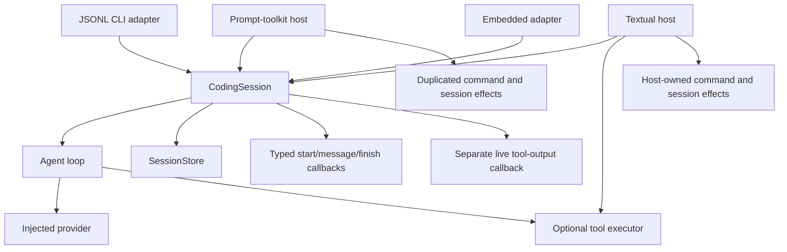
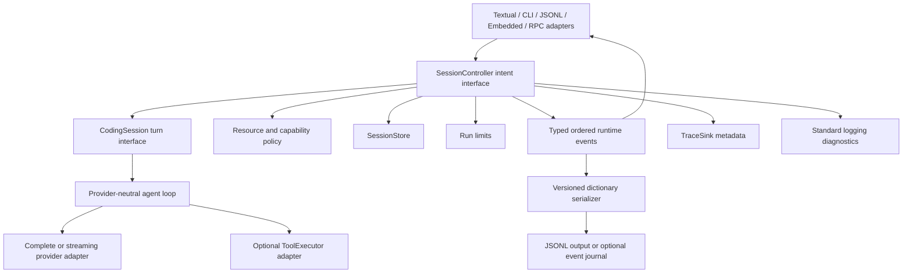

# Peon 0.3.0 Spec: Headless Runtime and Thin Hosts

Status: Draft for local implementation
Target release: 0.3.0
Prepared: 2026-07-21
Review baseline: clean `main` at `12b9b3f`
Source review: `peon-vs-mini-swe-agent.md`

## Problem Statement

Peon can already run headless through its agent loop, coding session, print and
JSONL modes, and embedded Python adapter. Its provider and tool contracts are
typed and independent of Textual. However, host-neutral behavior stops short of
a complete application interface:

- Runtime events are split between typed session callbacks, complete-message
  callbacks, live tool-output callbacks, worker completion, and CLI-specific
  dictionary serialization.
- Provider responses do not stream text deltas.
- Slash-command effects, provider setup, session transitions, tool policy, and
  resource actions are duplicated or embedded in interactive hosts.
- Textual is a thick application controller rather than a thin presentation
  host.
- Prompt-toolkit remains a second TUI despite the product decision to maintain
  Textual as the exclusive interactive UI.
- Headless modes disagree about default tools and capability selection.
- Unattended runs lack provider-call, elapsed-time, token, and cost limits.
- Durable conversation state, runtime events, and performance traces are
  separate in implementation but do not yet have one explicit public contract
  explaining their different purposes.
- Base installation pulls terminal UI dependencies into embedded and automation
  environments.

These gaps make future CLI, RPC, browser-served Textual, and embedded consumers
learn host-specific behavior. They also increase regression risk when commands,
sessions, streaming, or tools change.

## Solution

Peon 0.3.0 will introduce one host-neutral application seam above the existing
coding-session behavior. Callers dispatch typed intents and receive typed,
ordered runtime events. Stable adapters serialize those events to versioned
Python dictionaries and JSONL without making dictionaries the internal domain
model.

The release will:

- Preserve the provider-neutral agent loop and existing direct provider
  adapters; LiteLLM will not be introduced.
- Keep canonical conversation persistence separate from live runtime events and
  metadata-only performance traces.
- Move command effects, session transitions, runtime capability policy, and run
  limits behind a host-neutral session controller.
- Add normalized provider streaming, text/thinking deltas, tool lifecycle
  events, and cooperative cancellation while preserving non-streaming fallback.
- Make Textual a thin host that owns widgets, input, layout, focus, animation,
  and scheduling, while consuming controller events for application behavior.
- Remove prompt-toolkit as an interactive host after behavior parity is proved.
- Keep Textual optional for headless/library consumers and provide clear install
  guidance for TUI and browser-served use.
- Provide synchronous callback, iterator, async-iterator, dictionary, JSONL,
  and embedded adapters over the same typed event vocabulary.
- Add an optional redacted event journal for audit/replay without changing the
  normal session format.

The current working release will remain available in a detached backup worktree.
All 0.3.0 work will occur in a separate feature worktree through small,
independently validated commits.

## Goals and Release Criteria

Peon 0.3.0 is complete when:

1. A Python caller can supply a prompt, typed or validated serialized history,
   provider, optional capabilities, and limits without importing Textual.
2. The caller can receive one ordered typed event stream through callbacks,
   synchronous iteration, or asynchronous iteration.
3. A serializer can convert every public runtime event to a versioned standard
   Python dictionary and JSON line.
4. Existing JSON event schema version 1 remains available for compatibility;
   schema version 2 exposes the complete runtime vocabulary.
5. OpenAI-compatible streaming produces normalized text/thinking deltas and a
   final canonical message; non-streaming providers retain current behavior.
6. Tool start, live output, completion, failure, and cancellation appear in the
   same runtime event stream.
7. Conversation sessions persist canonical messages only. Runtime event
   journals and performance traces remain explicit, separate outputs.
8. Textual processes prompts, commands, sessions, settings, skills, and tools
   through the host-neutral controller rather than duplicating effects.
9. Prompt-toolkit is removed from runtime code, host registration, dependencies,
   and tests.
10. CLI task, print, JSONL, and Textual modes use one explicit capability policy;
    embedded use remains capability-free unless the caller opts in.
11. Unattended runs stop with typed reasons when configured limits are reached.
12. Core/headless installation succeeds without Textual. TUI installation and
    startup succeed with the Textual extra.
13. Existing 0.2 session files still load without migration.
14. Full tests, static typing, build, clean-install smoke tests, and baseline
    behavior checks pass before the version changes to 0.3.0.

## Architecture Map

### Current shape



### Target shape



### Ownership

- **Agent module:** provider-neutral messages, model responses, normalized
  provider stream chunks, tool execution contracts, turn orchestration, and
  portable runtime event facts. It never imports application or presentation
  modules.
- **AI module:** authentication, transport, SSE parsing, provider-specific chunk
  assembly, retry policy, request timeout, and normalization into complete
  responses or stream chunks.
- **Application module:** session controller, command effects, session/resource
  policy, capability profiles, limits, persistence composition, event
  correlation, versioned event serialization, and host selection.
- **Extensions module:** executable tool adapters, skills, hooks, and optional
  local or external execution implementations.
- **Textual host:** widget tree, rendering, keyboard and mouse input, focus,
  pickers, layout, animation, worker scheduling, and mapping typed events to
  presentation state.
- **Deployment adapters:** print, JSONL, embedded Python, future RPC, and
  external `textual-serve` launch. They do not own agent or command behavior.

## Selected Seams

### Primary seam

The highest behavior seam is the session controller intent interface. Tests and
hosts dispatch an intent and observe ordered typed events plus a terminal
result. This one seam covers prompt execution, commands, session transitions,
settings, capability policy, limits, and cancellation without reaching into a
host.

The interface must remain small:

- dispatch one typed intent;
- subscribe one event sink, or consume an iterator adapter;
- inspect immutable current session state;
- request cancellation.

### Existing seam retained

The coding-session prompt interface remains the lower-level headless turn seam.
It continues to support direct embedding and focused tests while the controller
adds command and application behavior above it. Existing callers are not forced
to adopt interactive command policy.

### Adapter seams

- Model providers retain complete-response support and may additionally satisfy
  a streaming-provider interface.
- Tool execution retains the existing executor interface; no new generic
  environment framework is added.
- Session stores retain append/load behavior for canonical messages.
- Trace sinks retain metadata-only operation records.
- Event serializers are pure adapters from typed events to mappings.

## User Stories

1. As an embedding developer, I want to submit a Python string and typed message
   history without importing a UI framework, so that Peon can run inside my
   application.
2. As an embedding developer, I want serialized history validated into Peon's
   typed messages, so that malformed external input fails clearly before a
   provider request.
3. As an automation developer, I want to consume standard Python dictionaries,
   so that I can integrate Peon without importing every internal event class.
4. As a typed Python caller, I want immutable event values, so that refactoring
   errors are caught before runtime.
5. As a synchronous caller, I want an event iterator, so that I can process
   progress incrementally with normal Python iteration.
6. As an asynchronous caller, I want an async event iterator, so that Peon can
   integrate with web servers without blocking their event loop.
7. As a GUI host, I want an event callback interface, so that I can schedule UI
   updates on the framework's own thread.
8. As an event consumer, I want stable schema versions, event names, correlation
   IDs, and ordering, so that upgrades do not silently break my integration.
9. As an event consumer, I want a monotonically increasing sequence within each
   run, so that events crossing thread or process adapters can be reordered or
   checked for loss.
10. As a terminal user, I want assistant text to appear as it arrives, so that
    long responses feel responsive.
11. As a terminal user, I want thinking text to obey visibility settings while
    streaming, so that hidden reasoning does not leak into presentation.
12. As a terminal user, I want tool starts and live output to appear through the
    same event path as model text, so that progress rendering is consistent.
13. As a caller, I want one final canonical assistant message after deltas, so
    that persisted history and resumed conversations remain deterministic.
14. As a caller, I want each delta tied to a message identity, so that final
    message reconciliation cannot duplicate text.
15. As an automation operator, I want to cancel an active turn, so that blocked
    or unwanted work stops promptly.
16. As an automation operator, I want provider-call and tool-call limits, so
    that recursive work cannot run forever.
17. As an automation operator, I want elapsed-time limits, so that unattended
    jobs have predictable upper bounds.
18. As an automation operator, I want token and cost limits when usage exists,
    so that provider spend remains bounded.
19. As an automation operator, I want an explicit terminal stop reason, so that
    limits, cancellation, provider errors, tool errors, and persistence errors
    can be handled differently.
20. As an operator using an endpoint without cost metadata, I want cost limits
    to report unavailable accounting rather than invent a value, so that Peon
    remains honest.
21. As a headless CLI user, I want one explicit capability profile, so that task,
    print, and JSONL modes expose the same tools.
22. As a safety-conscious user, I want a no-tools profile, so that model output
    cannot trigger local side effects.
23. As a repository reader, I want a read-only profile, so that Peon can inspect
    code without changing it or running shell commands.
24. As a coding-agent user, I want a coding profile with the established read,
    write, edit, and bash tools, so that normal work stays concise.
25. As an advanced caller, I want to inject an exact tool executor, so that my
    application controls available capabilities.
26. As an embedding developer, I want tools and resources disabled by default,
    so that importing Peon does not grant implicit filesystem access.
27. As a CLI user, I want skill and context discovery to remain independently
    configurable, so that project instructions are optional in headless runs.
28. As a session user, I want only canonical messages persisted, so that resume
    files remain compact and provider-ready.
29. As a session user, I want existing 0.2 JSONL files to load unchanged, so that
    upgrading does not lose conversations.
30. As an auditor, I want an explicit event journal option, so that I can retain
    a full run timeline when policy permits it.
31. As a security-conscious operator, I want event journals off by default and
    content redaction documented, so that prompts and tool output are not saved
    unexpectedly.
32. As an operator, I want metadata-only performance traces separate from
    conversation state, so that latency can be diagnosed without storing chat
    content.
33. As an operator, I want standard Python logging for errors and warnings, so
    that Peon fits existing log collection without a heavy observability stack.
34. As a maintainer, I want structured trace records for measured latency, so
    that performance analysis does not depend on parsing log prose.
35. As a Textual user, I want current keyboard, transcript, picker, session, and
    settings behavior preserved, so that the architecture migration does not
    degrade the terminal experience.
36. As a Textual maintainer, I want application effects outside widgets, so that
    rendering changes do not risk provider, tool, or persistence behavior.
37. As a future host author, I want slash commands to return typed outcomes, so
    that a CLI, Textual picker, or web adapter can present the same command.
38. As a future host author, I want selection requests represented as data, so
    that command logic does not call terminal input functions or Textual
    widgets.
39. As a Textual maintainer, I want an explicit event-router registry for known
    event classes, so that handlers remain isolated and testable.
40. As a Textual user, I want unsupported events handled safely, so that one new
    backend event cannot crash the transcript.
41. As an extension author, I want core events to describe domain/runtime facts,
    so that my extension is not tied to a kanban, card, or animation widget.
42. As an extension author, I want future custom UI events to be namespaced and
    validated, so that extensions cannot collide with built-in event types.
43. As a package consumer, I want a core/headless install without Textual, so
    that corporate dependency resolution stays small.
44. As a terminal user, I want an actionable error when TUI dependencies are
    absent, so that installing the correct extra is obvious.
45. As a Textual user, I want Textual to be the only maintained interactive TUI,
    so that effort is not split across duplicate implementations.
46. As a browser user, I want the Textual application to pass a
    `textual-serve` smoke test, so that browser delivery remains possible.
47. As a deployment owner, I want `textual-serve` treated as a separate adapter,
    so that authentication, multi-user isolation, and production hosting are
    not falsely claimed by core.
48. As a corporate user, I want direct OpenAI-compatible transport without
    LiteLLM, so that Peon avoids unnecessary dependency conflicts.
49. As a provider author, I want complete and streaming response interfaces, so
    that a non-streaming endpoint remains supported.
50. As a provider author, I want provider-specific stream fragments assembled in
    the AI adapter, so that the agent loop never branches by vendor.
51. As a maintainer, I want small migration commits with executable gates, so
    that regressions are found near their cause.
52. As a maintainer, I want a detached 0.2.0 backup worktree, so that the known
    working build is always runnable during migration.
53. As a maintainer, I want all 0.3.0 changes isolated from `main`, so that the
    current build remains untouched until final validation.
54. As a maintainer, I want reversible compatibility adapters during migration,
    so that old and new event paths can be compared before deletion.
55. As a release owner, I want the version bump last, so that incomplete slices
    cannot be mistaken for Peon 0.3.0.

## Implementation Decisions

### Release shape

- Peon 0.3.0 is a release train of small commits, not one broad rewrite.
- Existing public interfaces remain available through 0.3.0 unless explicitly
  listed as removed. The prompt-toolkit interactive host is the only planned
  runtime removal.
- Direct `run_task`, coding-session prompt, and embedded submit behavior remain
  supported. New event consumption is additive.
- Session JSONL format version 2 remains unchanged. No conversation migration is
  required.
- Package version, banners, and release documentation change only after every
  release gate passes.

### Runtime event vocabulary

- Public runtime events are immutable typed values. Dictionaries are serialized
  representations, not the internal model.
- Every event carries schema identity, event type, session/run/turn correlation
  when applicable, an injected-clock timestamp, and a sequence number scoped to
  the run.
- Built-in event families cover session lifecycle, turn lifecycle, canonical
  messages, assistant text delta, assistant thinking delta, tool start, bounded
  tool output, tool finish, command outcome, selection request, state change,
  cancellation, and terminal error/result.
- Streaming deltas carry a stable message identity. The final canonical message
  carries the same identity and complete content. Hosts reconcile rather than
  append duplicate text.
- Tool lifecycle events carry the provider call ID when available and one Peon
  operation ID always. Tool output identifies stream name and bounded chunk.
- Tool completion reports success, error, or cancellation and includes the
  canonical result that will enter provider history.
- Turn completion remains exactly once for every started turn. Its result
  includes status, stop reason, usage, and duration.
- Event handler failures are logged and isolated from turn state.
- Built-in typed events form a closed union for each release. Unknown serialized
  events follow adapter policy: ignore with a diagnostic by default, or reject
  in strict mode.

### Serialized event schemas

- One pure serializer owns mapping typed events to standard Python dictionaries.
- Schema version 1 preserves current CLI JSON event names and fields exactly.
- Schema version 2 serializes the complete typed vocabulary, including sequence,
  message identity, deltas, tool lifecycle, stop reasons, and command outcomes.
- The 0.3.0 CLI keeps schema version 1 as the default compatibility output and
  offers an explicit schema version 2 selection. Future default changes require
  a separate deprecation decision.
- JSONL output, embedded dictionary iteration, future RPC, and optional event
  journal use the same serializer. Hosts do not maintain private serializers.
- Serialization failures become terminal adapter errors; they do not mutate
  conversation state.

### Event delivery interfaces

- Callback delivery remains the canonical push interface for GUI hosts.
- A synchronous iterator adapter buffers typed or serialized events and returns
  one terminal result after iteration completes.
- An async-iterator adapter runs blocking provider/tool work outside the caller's
  event loop and forwards cancellation safely.
- Buffering is bounded. Slow consumers receive a defined overflow error or
  coalesced text/tool-output chunks; canonical messages and terminal events are
  never dropped.
- Embedded callers may choose typed events or serialized dictionaries.
- Raw history dictionaries pass through one strict validator before becoming
  typed messages. Unknown roles, malformed tool calls, and invalid field types
  fail before execution.

### Session controller

- One host-neutral session controller owns command effects, session transitions,
  active provider/model state, resource application, capability policy, run
  limits, and coding-session composition.
- Hosts dispatch typed intents. Initial intents include submit prompt, execute
  command, provide requested selection/input, cancel turn, select/new/fork
  session, and close session.
- The controller returns typed outcomes through the same runtime event stream.
- Interactive command flows never call a terminal input function or construct a
  widget. They emit selection/input requests containing stable option IDs,
  labels, safe metadata, and a continuation token.
- Hosts send a follow-up intent with the continuation token and selected value.
  Invalid, stale, or reused tokens fail without state mutation.
- Command definitions, argument validation, and effects live together behind
  the controller. Search ranking and display metadata remain reusable data.
- Presentation-only choices such as colors, spacing, focus, and key bindings stay
  in Textual configuration. Provider, tool, resource, reasoning, and session
  policy move to application configuration.

### Textual host and event router

- Textual is the sole maintained interactive TUI in 0.3.0.
- Textual owns widgets, rendering, transcript interaction, focus, key bindings,
  pickers, animation, and worker scheduling.
- Textual does not construct provider/tool policy, persist messages, execute
  command effects, or mutate session state directly after migration.
- A frontend-owned router registers handlers for known typed event classes.
  Handler registration is explicit and testable; it is not arbitrary dynamic
  import.
- Unsupported events use a safe fallback and diagnostic. They never load a
  widget based only on an event string.
- Core does not emit presentation requests such as `kanban` or `animation`.
- Namespaced extension UI events and widget factories remain reserved until a
  concrete extension requires them.
- Prompt-toolkit is removed only after command, session, resource, shell, and
  provider behavior is covered at the controller seam and Textual regressions
  pass.

### Textual browser delivery

- `textual-serve` is an optional deployment dependency, not a core dependency.
- A smoke test proves the Textual application can start under the serve launcher
  and reach its initial screen.
- Peon 0.3.0 does not claim native browser widgets, production authentication,
  multi-user authorization, durable web sessions, horizontal scaling, or secure
  public deployment.
- The reserved first-party webapp host remains unavailable unless separately
  specified.

### Provider streaming and cancellation

- Complete-response provider behavior remains required.
- Streaming is a separate optional provider interface discovered by capability,
  not by provider-name branching in the agent loop.
- Provider adapters normalize vendor fragments into text deltas, thinking
  deltas, tool-call assembly, usage updates, and one final response.
- OpenAI-compatible chat-completions streaming is the first concrete adapter.
  GitHub Copilot may reuse it only where protocol behavior is verified.
- Custom providers stream only when their configured endpoint contract supports
  the same normalized behavior; otherwise they use complete responses.
- Malformed, incomplete, or conflicting stream fragments produce a provider
  error and exactly one terminal turn result.
- Cancellation signals the active provider transport and closes the response
  where supported. Blocking DNS/TLS/OS calls remain bounded by configurable
  request timeout and are documented as best-effort cancellation.
- Retry policy belongs in the AI adapter. Retries occur only before visible
  response content or tool execution, preventing duplicated output and side
  effects.

### Run limits and stop reasons

- Run limits are immutable typed policy injected per controller/session run.
- Supported optional limits cover provider calls, tool calls, elapsed wall time,
  input tokens, output tokens, total tokens, and cost plus currency.
- Limits are disabled when omitted. Existing direct callers preserve current
  behavior unless they opt in.
- Limits are checked before provider/tool work and after each usage update.
- Elapsed limits are cooperative between operations; provider request timeout
  bounds an already-blocked transport.
- Missing usage never becomes zero. Token/cost limits with unavailable usage
  report accounting unavailable according to explicit policy rather than
  silently claiming enforcement.
- Cost is accumulated only when currencies are compatible.
- Terminal stop reasons distinguish completed, cancelled, provider-call limit,
  tool-call limit, elapsed limit, token limit, cost limit, provider error, tool
  error, persistence error, event-consumer error, and internal error.
- Status remains a compact success/error/cancelled category for compatibility;
  stop reason carries precise automation semantics.

### Capability policy

- One application-owned capability policy selects tools and resources for every
  CLI-hosted run.
- Built-in tool profiles are:
  - `none`: no model-callable tools;
  - `read-only`: read, list, find, and grep;
  - `coding`: read, write, edit, and bash;
  - `custom`: exact explicitly selected registered tools.
- CLI task, print, JSONL, and Textual modes default to `coding` for product
  consistency. Mutation/shell risk remains clearly documented and `none` is
  available for automation.
- Embedded use defaults to `none`; callers opt in by injecting an executor.
- Sample tools are never part of a production default profile.
- Skills and context discovery remain independent switches. Explicit resources
  remain usable when discovery is disabled.
- Tool definitions sent to providers exactly match executable names. Disabled
  tools cannot be invoked through stale or forged calls.

### Persistence, journal, traces, and logging

- Normal session files remain append-only canonical conversation state.
- Text deltas, transient processing state, animations, selection requests, and
  live tool chunks are not written to normal sessions.
- Canonical final assistant/tool messages are persisted once before their public
  message event is acknowledged.
- A separate event journal is opt-in and uses serialized schema version 2.
- Event journals declare that they may contain prompts, assistant content, tool
  arguments, tool output, paths, and secrets. Redaction and file permissions are
  application policy.
- Event journal failure is reported independently and does not corrupt session
  state. Strict automation may choose to make journal failure terminal.
- Metadata trace records remain content-free, correlated, structured, and
  disabled by default.
- Standard Python logging handles warnings, runtime errors, failed handlers,
  failed adapters, and operator diagnostics. It is not the latency schema.
- No OpenTelemetry or other heavy observability framework is added.
- Core and controller depend on store/sink interfaces, never JSONL paths.

### Packaging

- Prompt-toolkit is removed as dependency and runtime host.
- Textual moves to a TUI optional extra. Headless/core installation imports and
  runs without it.
- Browser serving uses a separate optional extra containing Textual and
  `textual-serve`.
- Starting interactive mode without the TUI extra returns an actionable install
  message without a traceback.
- Development setup installs all test-required extras.
- Python 3.13 remains the supported floor for 0.3.0. Lowering the floor requires
  a separate compatibility matrix and is not a metadata-only change.

### Execution adapters

- The existing tool-executor seam remains the execution-environment seam.
- Local registered tools remain the only built-in execution implementation in
  0.3.0.
- An application can inject a sandbox, container, remote, or policy-wrapped
  executor without changing the loop or controller.
- Peon will not add a generic environment framework or a built-in container
  implementation without a concrete deployment requirement and end-to-end
  filesystem plus command semantics.

### Compatibility

- Existing session files continue to load.
- Existing complete-response providers continue to work.
- Existing direct agent-loop and coding-session callers continue to work.
- Existing embedded submit and typed callback use continue to work.
- Existing JSON event schema version 1 remains the CLI default in 0.3.0.
- Prompt-toolkit host selection becomes unavailable with an actionable message.
- Textual behavior remains the interactive compatibility target.
- Reserved fullscreen and first-party webapp hosts remain unavailable.

## Testing Decisions

### Test philosophy

Good tests cross a public seam and assert observable behavior: emitted event
order/content, terminal result, persisted canonical messages, provider/tool
calls, host rendering, CLI records, or install/import success. Tests do not
assert private helper calls, internal queue implementation, or widget method
selection.

The primary test seam is session-controller intent dispatch with injected fake
provider, tool executor, session store, resource inventory, clocks, IDs, and
event sink. Most application behavior must be provable there without Textual.

The existing coding-session seam remains the focused runtime seam. Provider
adapter tests use fake transports. Textual tests cover presentation behavior
only after controller behavior is already proved.

### Contract tests

- A submitted prompt emits exactly one turn start, ordered message/tool/delta
  events as applicable, and exactly one terminal turn event.
- Event sequence and correlation remain deterministic with injected clocks and
  IDs.
- Complete and streaming provider paths produce the same final canonical
  conversation.
- Deltas reconcile with the final message without duplication.
- Tool start/output/finish events preserve order and call correlation.
- Cancellation and every run limit produce the expected status and stop reason.
- Missing usage and mixed currencies follow declared accounting policy.
- Capability profiles advertise and execute only allowed tools.
- Every command can execute through controller intents without host imports.
- Multi-step selection/input commands reject stale continuation tokens.
- Session new/resume/fork behavior and resource prompts remain compatible.
- Persistence stores canonical messages and excludes transient events.
- Event journal receives full schema version 2 records without altering normal
  session files.
- Trace records remain metadata-only and preserve duration/correlation.
- Event-handler, journal, trace, and logging failures follow isolation policy.

### Serialization tests

- Golden records lock existing schema version 1 output.
- Golden records cover every schema version 2 event type.
- Dictionary round-trip validation covers histories, tool calls, usage, stop
  reasons, and unknown fields.
- Strict and tolerant unknown-event policies are tested.
- JSON encoding handles Unicode and rejects non-serializable extension payloads.

### Provider tests

- Fake SSE streams cover text, thinking, fragmented tool arguments, usage,
  finish reasons, malformed frames, disconnects, retry-before-output, and
  cancellation.
- Complete-response tests remain unchanged and pass beside streaming tests.
- Provider-specific behavior stays in adapter tests, never controller tests.

### Host tests

- Textual renders typed deltas, final messages, thinking visibility, tool
  lifecycle, terminal errors, and cancellation.
- Textual input dispatches intents instead of directly executing command
  effects.
- Pickers render selection-request data and return continuation intents.
- Existing transcript spacing, colors, selection, shortcuts, session rows,
  provider setup, tool expansion, and resource display remain regression-tested.
- Unsupported events do not crash Textual.
- `textual-serve` gets a startup smoke test only; browser production behavior is
  not implied.

### Packaging tests

- A clean core install imports the agent, AI adapters, embedded adapter, and
  headless CLI without Textual or prompt-toolkit installed.
- Interactive startup without the TUI extra reports the install instruction.
- A clean TUI-extra install starts Textual.
- No source import loads Textual during embedded use.
- Wheel metadata exposes correct core, TUI, serve, and development dependencies.

### Migration gates

After each migration slice:

1. Run the narrow contract test for the changed seam.
2. Run all existing tests for touched hosts/modules.
3. Run full pytest.
4. Run static typing over the source package.
5. Run whitespace/diff validation.
6. Commit only that validated slice.

The final release additionally builds the wheel, installs core and TUI variants
in clean environments, runs CLI and embedded smoke tests, checks both event
schemas, and compares critical 0.2 behavior against the detached backup tree.

## Step-by-Step Migration Strategy

### Phase 0: Freeze and protect the working build

At spec time, tracked source is clean on `main` at `12b9b3f`. Recheck this at
implementation time; do not assume the recorded SHA is still current.

1. From the current working tree, require a clean tracked status. Preserve
   ignored local review/spec files separately because Git worktrees do not copy
   ignored files.
2. Run the full 0.2 validation gate before creating migration branches:

```powershell
uv sync
uv run pytest
uv run mypy src/peon
git diff --check
```

3. Record the validated commit and create an annotated safety tag:

```powershell
$baseline = git rev-parse HEAD
git tag -a peon-v0.2.0-working $baseline -m "Validated Peon 0.2.0 migration baseline"
```

4. Create a detached, read-only-in-practice backup worktree beside the current
   repository:

```powershell
git worktree add ..\peon-v0.2.0-backup --detach $baseline
```

5. Validate that backup independently. Do not edit or install feature code in
   it:

```powershell
Push-Location ..\peon-v0.2.0-backup
uv sync
uv run pytest
uv run mypy src/peon
Pop-Location
```

6. Create a separate feature worktree and branch from the same baseline. Keep
   the current `main` tree untouched for review and comparison:

```powershell
git worktree add -b feature/peon-0.3.0 ..\peon-v0.3.0 $baseline
```

7. Copy ignored planning documents into the feature worktree's ignored
   `.scratch` directory for local reference. Do not force-add them unless the
   user later chooses to version the spec.
8. Never use destructive reset or checkout to recover a failed slice. Revert a
   validated feature commit or delete/recreate only the feature worktree after
   preserving wanted local changes. The detached backup and tagged commit stay
   unchanged.

### Phase 1: Characterize 0.2 behavior

1. Add or tighten tests for current coding-session event order, JSON schema
   version 1, persistence ordering, CLI output, embedded imports, Textual
   rendering, commands, sessions, skills, shell behavior, and cancellation.
2. Capture only stable external behavior. Do not snapshot incidental private
   implementation.
3. Run full gates and commit this tests-only checkpoint.
4. Compare the same tests against the backup tree where practical.

Exit condition: later refactors can be proven compatible without running both
implementations manually.

### Phase 2: Introduce typed events and serializers additively

1. Define typed runtime event values and common event metadata without changing
   current host callbacks.
2. Add schema version 1 serializer matching existing JSON records byte-for-byte
   where ordering is contractual.
3. Add schema version 2 serializer for current non-streaming lifecycle and
   messages.
4. Bridge existing coding-session callbacks into the new event sink while the
   legacy callback remains active.
5. Run both paths in tests and assert equivalent terminal messages/results.
6. Commit before changing any host.

Exit condition: typed events and serializers exist, but production behavior is
unchanged.

### Phase 3: Unify live tool lifecycle

1. Convert separate live tool callbacks into typed tool start/output/finish
   events.
2. Keep the old live callback as a temporary compatibility adapter.
3. Update JSON schema version 2 output and embedded iterator adapters.
4. Verify bounded output, cancellation, and persistence remain unchanged.
5. Commit, then remove the compatibility callback only after all consumers have
   migrated in later phases.

Exit condition: all tool progress can travel through one event interface.

### Phase 4: Add the session controller

1. Introduce controller state, typed intents, and typed command outcomes around
   the existing coding session.
2. Move pure command effects first: help, tools, skills, reasoning, and session
   information.
3. Move session transitions next: new, resume, and fork.
4. Move provider/model/settings flows using selection requests and continuation
   tokens.
5. Migrate non-interactive CLI, print, JSONL, and embedded adapters before
   Textual. Keep output compatibility tests green after each intent family.
6. Remove duplicated registry-default composition behind one application
   factory.
7. Commit each command family separately if the diff is not reviewable as one
   slice.

Exit condition: all application behavior is executable without a TUI.

### Phase 5: Migrate Textual to a thin host

1. Add a Textual-owned router for known typed events.
2. Route prompt submission and cancellation through controller intents.
3. Route transcript messages, tool output, processing state, usage, and errors
   from controller events.
4. Replace direct command effects with intent dispatch. Keep picker, focus,
   layout, animation, and keyboard behavior in Textual.
5. Migrate direct bang-shell behavior through an application intent while
   preserving visible and hidden semantics.
6. Run focused Textual tests after every behavior family, then full gates.
7. Remove legacy event/live-output bridges only after Textual and headless
   adapters use the new path.

Exit condition: Textual contains presentation and scheduling policy, not domain
or application effects.

### Phase 6: Retire prompt-toolkit

1. Confirm every behavior worth retaining is covered at the controller seam and
   available through Textual or headless adapters.
2. Remove prompt-toolkit host registration and startup selection.
3. Remove prompt-toolkit implementation and host-specific tests.
4. Keep an actionable unavailable-host error for explicit old selections during
   0.3.0 if migration value outweighs immediate deletion.
5. Remove dependency metadata only after import and packaging tests pass.

Exit condition: Textual is the sole interactive TUI and no runtime import or
package dependency references prompt-toolkit.

### Phase 7: Add capability policy and run limits

1. Add capability profiles behind controller composition.
2. Make task, print, JSONL, and Textual modes resolve profiles identically.
3. Preserve embedded default of no tools and explicit injection.
4. Add typed limits and stop reasons to the lower runtime, then surface them
   through controller and event schemas.
5. Test each limit at the controller seam with injected clocks and usage.
6. Update CLI options without changing session format.

Exit condition: unattended behavior is explicit, bounded, and machine-readable.

### Phase 8: Add provider streaming

1. Define normalized stream chunks and streaming-provider capability.
2. Implement and test OpenAI-compatible SSE parsing with fake transports.
3. Teach the loop to consume either complete responses or normalized chunks
   without provider-name branches.
4. Emit text/thinking deltas and assemble one final canonical response.
5. Add provider cancellation and request timeout behavior.
6. Migrate Textual rendering to deltas while retaining complete-response tests.
7. Add synchronous and asynchronous iterator adapters with bounded buffering.
8. Keep streaming disabled for unverified custom endpoints.

Exit condition: streaming and non-streaming providers produce equivalent final
history and terminal results.

### Phase 9: Separate packaging and add journal support

1. Move Textual to the TUI extra and add the serve extra.
2. Add clean-install core/TUI/serve smoke environments.
3. Add optional schema version 2 event journal with explicit content warning,
   redaction hook, strict/non-strict failure policy, and safe append behavior.
4. Keep metadata traces and standard logging separate.
5. Validate no embedded import loads terminal dependencies.

Exit condition: headless install is small; optional operational outputs have
clear contracts.

### Phase 10: Validate browser-served Textual

1. Launch the Textual application through `textual-serve` in a smoke test.
2. Verify initial render, prompt submission, streamed output, tool display, and
   cancellation in a local non-production environment.
3. Record deployment limitations rather than adding authentication or multi-user
   policy to core.

Exit condition: browser delivery works as an adapter without changing runtime
contracts.

### Phase 11: Release 0.3.0

1. Run focused suites, full pytest, static typing, and diff validation.
2. Build a wheel and test clean core, TUI, and serve installations.
3. Run one complete-response and one streaming OpenAI-compatible smoke test with
   fake or approved local endpoints.
4. Verify current and legacy session files load.
5. Verify JSON event schema versions 1 and 2.
6. Compare critical Textual and CLI workflows with the detached 0.2 backup.
7. Update version metadata and visible banners to 0.3.0 in the final feature
   commit.
8. Update canonical project history with completed architecture facts and test
   evidence only after validation.
9. Merge through normal review. Tag the release commit separately; retain the
   0.2 safety tag and backup worktree until post-release verification finishes.

## Rollback Strategy

- `main` remains untouched until the complete feature branch passes release
  gates.
- Every phase ends in a validated commit. Regressions are removed with
  non-destructive revert commits on the feature branch.
- Additive compatibility adapters remain until all consumers migrate; old paths
  are deleted only in later dedicated commits.
- Streaming falls back to complete responses per provider capability.
- JSON schema version 1 remains available if schema version 2 consumers fail.
- Existing session persistence remains unchanged, so returning to 0.2 does not
  require data rollback.
- The detached backup worktree provides an immediately runnable known-good
  executable for behavior comparison.
- If release validation fails, do not bump version or merge. Fix or revert the
  smallest failed phase, then rerun its focused and full gates.

## Out of Scope

- LiteLLM or another universal provider dependency.
- Replacing typed internal events with arbitrary dictionaries.
- Persisting every text delta, tool chunk, animation, or selection event in
  normal conversation sessions.
- OpenTelemetry, metrics servers, or a heavy observability framework.
- A generic dynamic widget-plugin framework.
- Backend events that request a specific presentation such as kanban cards or
  animations.
- Kanban boards, dashboards, office workflows, or report generation.
- A subagent scheduler or multi-agent orchestration framework.
- Native browser widgets or a first-party production web application.
- Authentication, authorization, tenancy, and public deployment for
  `textual-serve`.
- Fullscreen TUI mode.
- Context compaction, undo/redo, export/share, or unrelated Pi parity work.
- A built-in Docker, Podman, remote, or sandbox execution implementation.
- A new generic execution-environment framework.
- Changing normal session JSONL format or persisting raw provider payloads.
- Lowering the Python version floor in 0.3.0.
- Streaming for provider contracts that have not been verified.
- Namespaced extension UI events until one concrete extension requires them.

## Further Notes

- "Headless" means no terminal framework import or interaction is required. It
  does not require streaming; streaming is added because responsive hosts and
  automation progress benefit from it.
- "Thin host" means presentation and input policy stay in Textual while domain
  and application effects live behind the controller seam. Textual is not a
  passive renderer and may own workers, focus, animations, and widget state.
- Session state, runtime event delivery, event journals, traces, and logs solve
  different problems. Peon must keep those interfaces distinct even when JSONL
  is used by more than one adapter.
- Event schemas describe runtime facts. Future hosts choose their own visual
  representation.
- The local spec and review are ignored planning artifacts. They are not issue
  tracker records and receive no triage label unless the user later requests
  publication.
- This release intentionally values migration evidence over rapid deletion.
  Compatibility bridges may look temporarily redundant; each must have a named
  removal phase and tests proving both paths before deletion.
